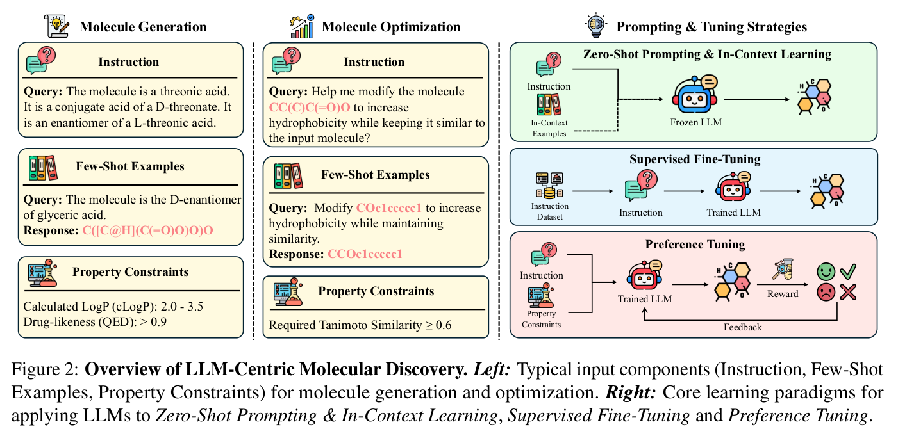
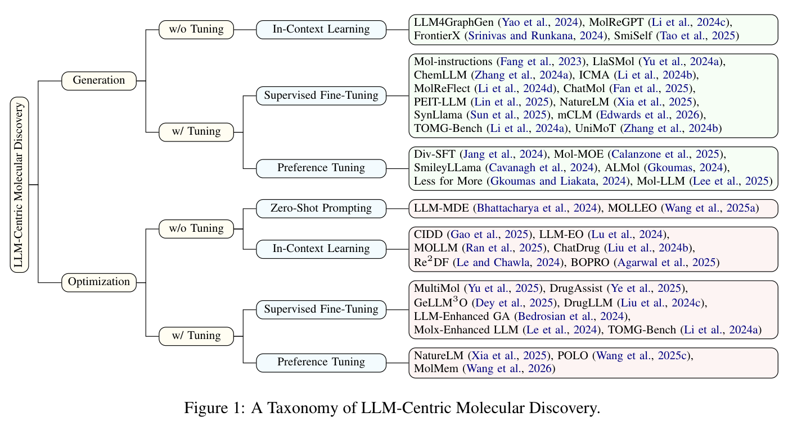
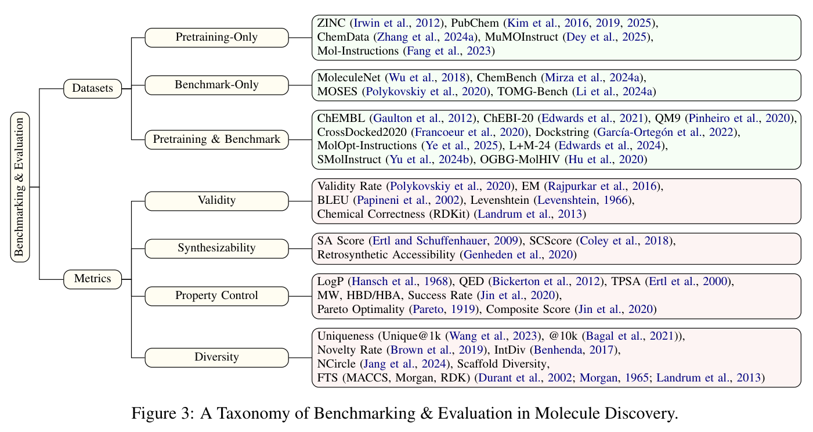
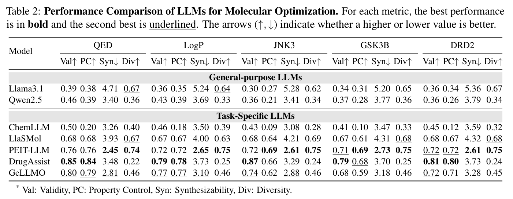
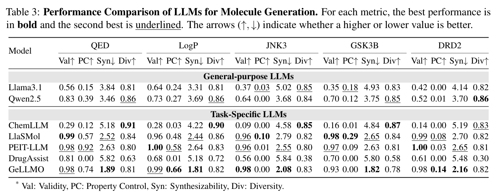

# Awesome LLM-Centric Molecular Discovery

A curated reading list for text-guided molecule generation and optimization, accompanying our **ACL 2026** survey:

**[A Survey of Large Language Models for Text-Guided Molecular Discovery: From Molecule Generation to Optimization](https://aclanthology.org/2026.acl-long.2026/)**

Ziqing Wang, Kexin Zhang, Zihan Zhao, Yibo Wen, Abhishek Pandey, Han Liu, and Kaize Ding.

[Paper](https://aclanthology.org/2026.acl-long.2026/) · [PDF](https://aclanthology.org/2026.acl-long.2026.pdf) · [Citation](#citation)

[](assets/discovery-workflow.png)

## Contents

- [Overview](#overview)
- [Molecule Generation](#molecule-generation)
- [Molecule Optimization](#molecule-optimization)
- [Datasets](#datasets)
- [Evaluation Metrics](#evaluation-metrics)
- [Tools and Benchmarks](#tools-and-benchmarks)
- [Results from the Survey](#results-from-the-survey)
- [Contributing](#contributing)
- [Citation](#citation)

## Overview

The survey focuses on foundation-scale LLMs, with at least one billion parameters, that directly generate or edit molecular structures. Molecular property prediction, chemical question answering, and tool orchestration are complementary topics rather than the main method categories; related datasets and evaluation tools are included below.

- **Molecule generation:** design a new molecule from textual instructions and optional property constraints.
- **Molecule optimization:** modify an input molecule to improve its properties, often under structural similarity constraints.
- **Learning paradigms:** zero-shot prompting and in-context learning (ICL) without parameter updates; supervised fine-tuning (SFT) and preference tuning with parameter updates. Preference tuning includes offline preference objectives and reward-based reinforcement learning.
- **Evaluation dimensions:** validity, synthesizability, property control, and diversity.

[](assets/method-taxonomy.png)

The figures reproduce the published survey. The reading list also includes subsequent additions. Methods can appear in both task tables when they address both tasks. Resources link to code, models, datasets, or project pages; a dash means no additional resource is linked.

## Molecule Generation

| Method | Publication | Category | Paper | Resources |
|:--|:--|:--|:--|:--|
| LLM4GraphGen | arXiv 2024 | In-Context Learning | [Exploring the Potential of Large Language Models in Graph Generation](https://arxiv.org/abs/2403.14358) | — |
| MolReGPT | TKDE 2024 | In-Context Learning | [Empowering Molecule Discovery for Molecule-Caption Translation with Large Language Models: A ChatGPT Perspective](https://arxiv.org/abs/2306.06615) | [Code](https://github.com/phenixace/MolReGPT) |
| FrontierX | arXiv 2024 | In-Context Learning | [Crossing New Frontiers: Knowledge-Augmented Large Language Model Prompting for Zero-Shot Text-Based De Novo Molecule Design](https://arxiv.org/abs/2408.11866) | — |
| SmiSelf | EMNLP 2025 | In-Context Learning / Validity Correction | [How to Make Large Language Models Generate 100% Valid Molecules?](https://aclanthology.org/2025.emnlp-main.1350/) | [Code](https://github.com/wentao228/SmiSelf) |
| ICMA | TKDE 2025 | Supervised Fine-Tuning | [Large Language Models are In-Context Molecule Learners](https://arxiv.org/abs/2403.04197) | [Code](https://github.com/phenixace/ICMA) |
| Mol-Instructions | ICLR 2024 | Supervised Fine-Tuning | [Mol-Instructions: A Large-Scale Biomolecular Instruction Dataset for Large Language Models](https://arxiv.org/abs/2306.08018) | [Code and data](https://github.com/zjunlp/Mol-Instructions) |
| LlaSMol | COLM 2024 | Supervised Fine-Tuning | [LlaSMol: Advancing Large Language Models for Chemistry with a Large-Scale, Comprehensive, High-Quality Instruction Tuning Dataset](https://arxiv.org/abs/2402.09391) | [Code and models](https://github.com/OSU-NLP-Group/LLM4Chem) |
| ChemLLM | arXiv 2024 | Supervised Fine-Tuning | [ChemLLM: A Chemical Large Language Model](https://arxiv.org/abs/2402.06852) | [Model](https://huggingface.co/AI4Chem/ChemLLM-7B-Chat) |
| MolReFlect | TKDE 2026, accepted | Supervised Fine-Tuning | [MolReFlect: Towards In-Context Fine-grained Alignments between Molecules and Texts](https://arxiv.org/abs/2411.14721) | [Code](https://github.com/phenixace/MolReFlect) |
| ChatMol | arXiv 2025 | Supervised Fine-Tuning | [ChatMol: A Versatile Molecule Designer Based on the Numerically Enhanced Large Language Model](https://arxiv.org/abs/2502.19794) | — |
| PEIT-LLM | arXiv 2024 | Supervised Fine-Tuning | [Property Enhanced Instruction Tuning for Multi-task Molecule Generation with LLMs](https://arxiv.org/abs/2412.18084) | [Code](https://github.com/chenlong164/PEIT) |
| NatureLM | arXiv 2025 | Supervised Fine-Tuning | [NatureLM: Deciphering the Language of Nature for Scientific Discovery](https://arxiv.org/abs/2502.07527) | [Project](https://naturelm.github.io/) |
| SynLlama | ACS Central Science 2025 | Supervised Fine-Tuning | [SynLlama: Generating Synthesizable Molecules and Their Analogs with Large Language Models](https://doi.org/10.1021/acscentsci.5c01285) | [Code](https://github.com/THGLab/SynLlama) |
| mCLM | ICLR 2026 | Supervised Fine-Tuning | [mCLM: A Modular Chemical Language Model that Generates Functional and Makeable Molecules](https://proceedings.iclr.cc/paper_files/paper/2026/hash/76f2614f3cabc22b8a1e0d9a6aa35b61-Abstract-Conference.html) | [Code and models](https://github.com/blender-nlp/mCLM) |
| TOMG-Bench | arXiv 2024 | Supervised Fine-Tuning | [TOMG-Bench: Evaluating LLMs on Text-based Open Molecule Generation](https://arxiv.org/abs/2412.14642) | [Data and evaluation](https://github.com/phenixace/TOMG-Bench) |
| UniMoT | arXiv 2024 | Supervised Fine-Tuning | [UniMoT: Unified Molecule-Text Language Model with Discrete Token Representation](https://arxiv.org/abs/2408.00863) | [Project](https://uni-mot.github.io/) |
| Div-SFT | arXiv 2024 | Preference Tuning | [Can LLMs Generate Diverse Molecules? Towards Alignment with Structural Diversity](https://arxiv.org/abs/2410.03138) | — |
| Mol-MoE | arXiv 2025 | Preference Tuning | [Mol-MoE: Training Preference-Guided Routers for Molecule Generation](https://arxiv.org/abs/2502.05633) | [Code](https://github.com/ddidacus/mol-moe) |
| SmileyLlama | Nature Computational Science 2026 | Preference Tuning | [SmileyLlama: Modifying Large Language Models for Directed Chemical Space Exploration](https://doi.org/10.1038/s43588-026-00986-y) | [Code and models](https://github.com/THGLab/SmileyLlama) |
| ALMol | ACL Workshop 2024 | Preference Tuning | [ALMol: Aligned Language-Molecule Translation LLMs through Offline Preference Contrastive Optimisation](https://arxiv.org/abs/2405.08619) | — |
| Less for More | ACL 2025 | Preference Tuning | [Less for More: Enhanced Feedback-aligned Mixed LLMs for Molecule Caption Generation and Fine-Grained NLI Evaluation](https://aclanthology.org/2025.acl-long.144/) | — |
| Mol-LLM | arXiv 2025 | Preference Tuning | [Mol-LLM: Multimodal Generalist Molecular LLM with Improved Graph Utilization](https://arxiv.org/abs/2502.02810) | [Training data](https://huggingface.co/datasets/KU-AGI/Mol-LLM-trainset) |
| LLMol | arXiv 2026 | Preference Tuning | [Adopting Reinforcement Learning with Verifiable Rewards for Molecular Generation](https://arxiv.org/abs/2607.19044) | — |

## Molecule Optimization

| Method | Publication | Category | Paper | Resources |
|:--|:--|:--|:--|:--|
| MOLLEO | ICLR 2025 | Zero-Shot Prompting | [Efficient Evolutionary Search over Chemical Space with Large Language Models](https://openreview.net/forum?id=awWiNvQwf3) | [Code](https://github.com/zoom-wang112358/MOLLEO) |
| LLM-MDE | JCIM 2024 | Zero-Shot Prompting | [Large Language Models as Molecular Design Engines](https://doi.org/10.1021/acs.jcim.4c01396) | [Code and data](https://zenodo.org/records/11110873) |
| CIDD | NeurIPS 2025 | In-Context Learning | [CIDD: Collaborative Intelligence for Structure-Based Drug Design Empowered by LLMs](https://openreview.net/forum?id=7k7cubl1iL) | [Code](https://github.com/bowen-gao/CIDD) |
| LLM-EO | JACS 2025 | In-Context Learning | [Generative Design of Functional Metal Complexes Utilizing the Internal Knowledge and Reasoning Capability of Large Language Models](https://doi.org/10.1021/jacs.5c02097) | [Code](https://github.com/deepprinciple/llmeo) |
| MOLLM | arXiv 2025 | In-Context Learning | [MOLLM: Multi-Objective Large Language Model for Molecular Design — Optimizing with Experts](https://arxiv.org/abs/2502.12845) | — |
| ChatDrug | ICLR 2024 | In-Context Learning | [Conversational Drug Editing Using Retrieval and Domain Feedback](https://openreview.net/forum?id=yRrPfKyJQ2) | [Code](https://github.com/chao1224/ChatDrug) |
| RE²DF | arXiv 2024 | In-Context Learning | [Utilizing Large Language Models in an Iterative Paradigm with Domain Feedback for Molecule Optimization](https://arxiv.org/abs/2410.13147) | — |
| BOPRO | ICLR 2025 | In-Context Learning | [Searching for Optimal Solutions with LLMs via Bayesian Optimization](https://openreview.net/forum?id=aVfDrl7xDV) | [Code](https://github.com/amazon-science/BOPRO-ICLR-2025) |
| MT-Mol | Findings of EMNLP 2025 | In-Context Learning / Tool Feedback | [MT-Mol: Multi Agent System with Tool-based Reasoning for Molecular Optimization](https://aclanthology.org/2025.findings-emnlp.619/) | — |
| MultiMol | arXiv 2025 | Supervised Fine-Tuning | [Collaborative Expert LLMs Guided Multi-Objective Molecular Optimization](https://arxiv.org/abs/2503.03503) | [Code](https://github.com/jiajunyu1999/LLM4Drug) |
| DrugAssist | Briefings in Bioinformatics 2025 | Supervised Fine-Tuning | [DrugAssist: A Large Language Model for Molecule Optimization](https://doi.org/10.1093/bib/bbae693) | [Code](https://github.com/blazerye/DrugAssist) |
| GeLLM³O | arXiv 2025 | Supervised Fine-Tuning | [GeLLM³O: Generalizing Large Language Models for Multi-property Molecule Optimization](https://arxiv.org/abs/2502.13398) | [Code](https://github.com/ninglab/GeLLMO) |
| DrugLLM | Chemical Science 2026 | Supervised Fine-Tuning | [Few-shot Molecular Property Optimization via a Domain-Specialized Large Language Model](https://doi.org/10.1039/D5SC08859C) | [Code](https://github.com/ziyanglichuan/DrugLLM) |
| LLM-Enhanced GA | NeurIPS Workshop 2024 | Supervised Fine-Tuning | [Small Molecule Optimization with Large Language Models](https://openreview.net/forum?id=p5VDaa8aIY) | [Code](https://github.com/yerevann/chemlactica) |
| MolX-Enhanced LLM | arXiv 2024, v2 | Supervised Fine-Tuning | [MolX: Enhancing Large Language Models for Molecular Learning with a Multi-Modal Extension](https://arxiv.org/abs/2406.06777v2) | [Code](https://github.com/lhkhiem28/MolX) |
| TOMG-Bench | arXiv 2024 | Supervised Fine-Tuning | [TOMG-Bench: Evaluating LLMs on Text-based Open Molecule Generation](https://arxiv.org/abs/2412.14642) | [Data and evaluation](https://github.com/phenixace/TOMG-Bench) |
| NatureLM | arXiv 2025 | Preference Tuning | [NatureLM: Deciphering the Language of Nature for Scientific Discovery](https://arxiv.org/abs/2502.07527) | [Project](https://naturelm.github.io/) |
| POLO | KDD 2026 | Preference Tuning | [POLO: Preference-Guided Multi-Turn Reinforcement Learning for Sample-Efficient Lead Optimization](https://doi.org/10.1145/3770855.3819016) | [Code](https://github.com/REAL-Lab-NU/POLO) |
| MolMem | ACL 2026 | Preference Tuning | [MolMem: Memory-Augmented Agentic Reinforcement Learning for Sample-Efficient Molecular Optimization](https://aclanthology.org/2026.acl-long.2024/) | [Code](https://github.com/REAL-Lab-NU/MolMem) |
| RePO | ICLR 2026 | Preference Tuning | [Reference-guided Policy Optimization for Molecular Optimization via LLM Reasoning](https://arxiv.org/abs/2603.05900) | [Code](https://github.com/tmlr-group/RePO) |
| LLMol | arXiv 2026 | Preference Tuning | [Adopting Reinforcement Learning with Verifiable Rewards for Molecular Generation](https://arxiv.org/abs/2607.19044) | — |

## Datasets

Counts refer to the linked releases or subsets. Compounds, activity measurements, docked poses, and instruction rows are different units; datasets also differ in whether they contain molecule, protein, or general-language examples.

| Dataset | Scale / Release | Main Use | Resource |
|:--|:--|:--|:--|
| PubChem | Continuously updated; specify the downloaded snapshot | Compound structures, properties, annotations, and bioassays | [Downloads](https://pubchem.ncbi.nlm.nih.gov/docs/downloads) |
| ChEMBL | ChEMBL 35: 2,496,335 compounds; 21,123,501 activities | Bioactivity data and molecular discovery | [Release notes](https://chembl.blogspot.com/2024/12/heres-nice-christmas-gift-chembl-35-is.html) · [Downloads](https://ftp.ebi.ac.uk/pub/databases/chembl/ChEMBLdb/releases/chembl_35/) |
| CrossDocked2020 | Version- and subset-dependent collections of docked poses | Protein–ligand pose and affinity modeling | [Data](https://github.com/gnina/models/tree/master/data/CrossDocked2020) |
| ZINC | Release- and subset-dependent | Purchasable compounds and virtual screening | [Downloads](https://wiki.docking.org/index.php?title=ZINC15%3AGetting_started#Downloading_SMILES) |
| DOCKSTRING | Over 260K ligands across 58 targets | Docking-based regression, screening, and molecular design | [Project](https://dockstring.github.io/) |
| ChEBI-20 | 33,010 molecule–description pairs | Text–molecule retrieval, captioning, and generation | [Data](https://github.com/cnedwards/text2mol/tree/master/data) |
| OGBG-MolHIV | 41,127 molecular graphs | HIV activity prediction | [Dataset](https://ogb.stanford.edu/docs/graphprop/#ogbg-mol) |
| MOSES | 1,936,962 molecular structures | Distribution-learning molecular generation benchmark | [Data and evaluation](https://github.com/molecularsets/moses) |
| MoleculeNet | 17 dataset collections; over 700K compounds in the original release | Molecular property prediction | [Paper and dataset overview](https://doi.org/10.1039/C7SC02664A) |
| QM9 | 133,885 molecules | Quantum properties and 3D molecular structures | [Data](https://figshare.com/collections/Quantum_chemistry_structures_and_properties_of_134_kilo_molecules/978904) |
| TOMG-Bench / OpenMolIns | 45K test examples across 9 subtasks; up to 1.2M instruction examples | Text-guided generation, editing, and optimization | [Data and evaluation](https://github.com/phenixace/TOMG-Bench) |
| MuMOInstruct | 872,483 rows in the public dataset | Multi-property molecular optimization | [Dataset](https://huggingface.co/datasets/NingLab/MuMOInstruct) |
| ChemData700K | 726,776 instruction rows in the released subset | Chemistry instruction tuning | [Dataset](https://huggingface.co/datasets/AI4Chem/ChemData700K) |
| ChemBench | Curated chemistry question bank | Chemical knowledge and reasoning evaluation | [Dataset](https://huggingface.co/datasets/jablonkagroup/ChemBench) |
| Mol-Instructions | 2,043,587 instructions across molecule, protein, and biomolecular-text tasks | Biomolecular instruction tuning | [Data and tasks](https://github.com/zjunlp/Mol-Instructions) |
| MolOpt-Instructions | 1,236,462 public-release rows, including general instructions | Molecular optimization instruction tuning | [Dataset](https://huggingface.co/datasets/blazerye/MolOpt-Instructions) |
| L+M-24 | 321,120 rows in the released training split | Description-conditioned generation and molecule captioning | [Training data](https://huggingface.co/datasets/language-plus-molecules/LPM-24_train) · [Evaluation](https://github.com/language-plus-molecules/LPM-24-Dataset) |
| SMolInstruct | 3.3M examples; 1.6M distinct molecules; 14 tasks | Small-molecule chemistry instruction tuning | [Dataset](https://huggingface.co/datasets/osunlp/SMolInstruct) |

## Evaluation Metrics

The survey organizes evaluation around four complementary dimensions. No single score establishes that a molecule is useful or experimentally synthesizable.

| Dimension | Representative Metrics | What to Check |
|:--|:--|:--|
| Validity | RDKit parsing and sanitization; chemical constraint satisfaction | Are molecular structures valid, and are task-specific structural constraints met? |
| Synthesizability | SA Score; SCScore; retrosynthetic route availability | Can a plausible synthesis route be found? Low heuristic complexity alone is not proof of laboratory feasibility. |
| Property Control | QED, LogP, TPSA, MW, HBD/HBA, target activity; constrained success rate; Pareto analysis | Are the requested objectives satisfied, and what trade-offs occur across properties? |
| Diversity | Uniqueness; novelty; internal diversity; scaffold diversity; NCircle | Does the generated set cover distinct structures rather than repeat a small set of molecules? |

Reference-based measures include exact match, BLEU, Levenshtein distance, and fingerprint Tanimoto similarity. FCD compares generated and reference distributions. These measures complement, rather than replace, chemical validity and task-specific property evaluation.

For comparable results, specify the dataset split, model checkpoint, sampling settings, oracle implementation, fingerprint parameters, similarity constraints, success thresholds, and evaluation budget. State whether success rates use all attempts or only valid molecules as their denominator, and whether cached oracle evaluations count toward the budget.

[](assets/evaluation-taxonomy.png)

## Tools and Benchmarks

| Resource | Role | Link |
|:--|:--|:--|
| RDKit | SMILES parsing, sanitization, fingerprints, and descriptors | [Documentation](https://www.rdkit.org/docs/) |
| AiZynthFinder | Retrosynthetic route planning | [Code](https://github.com/MolecularAI/aizynthfinder) |
| ASKCOS | Synthesis planning and reaction assessment | [Application](https://askcos.mit.edu/) · [Code](https://gitlab.com/mlpds_mit/askcosv2/askcos2_core) |
| MOSES | Distribution-learning metrics and benchmarks | [Code](https://github.com/molecularsets/moses) |
| GuacaMol | Distribution-learning and goal-directed generation benchmarks | [Code](https://github.com/BenevolentAI/guacamol) |
| MolScore | Goal-directed molecular scoring and evaluation | [Code](https://github.com/MorganCThomas/MolScore) |
| Therapeutics Data Commons | Drug-discovery datasets, oracles, and benchmarks | [Documentation](https://tdcommons.ai/) |
| TOMG-Bench | Text-guided generation, editing, and optimization evaluation | [Code](https://github.com/phenixace/TOMG-Bench) |
| ChemBench | Chemical knowledge and reasoning evaluation | [Code](https://github.com/lamalab-org/chembench) |

## Results from the Survey

Appendix H compares seven models across generation and optimization on QED, LogP, JNK3, GSK3β, and DRD2. The tables below reproduce the paper's reported results, not a live leaderboard.

- **Val:** fraction of outputs that are valid molecular strings.
- **PC:** property control, calculated over valid outputs. For optimization, success means any favorable change relative to the input. For generation, thresholds are QED > 0.6, LogP > 2.0, and activity scores > 0.5 for JNK3, GSK3β, and DRD2.
- **Syn:** mean SA Score over valid molecules; lower is better.
- **Div:** internal diversity based on Morgan-fingerprint Tanimoto similarity; higher is better.

Optimization prompts request similarity of at least 0.6 to the input molecule. The generation and optimization PC values use different success definitions and should not be treated as interchangeable success rates. Prompt templates and experimental details are in [Appendix H](https://aclanthology.org/2026.acl-long.2026.pdf#page=27).

### Molecular Optimization

[](assets/optimization-results.png)

### Molecule Generation

[](assets/generation-results.png)

Figures 1–3 and Tables 2–3 are reproduced from [Wang et al., ACL 2026](https://aclanthology.org/2026.acl-long.2026/), under [CC BY 4.0](https://creativecommons.org/licenses/by/4.0/). Click an image to view it at full resolution.

## Contributing

Suggestions and corrections are welcome through issues or pull requests. Please include the paper title, publication year or venue, task, learning paradigm, and official paper and resource links.

## Citation

```bibtex
@inproceedings{wang-etal-2026-survey,
  title={A Survey of Large Language Models for Text-Guided Molecular Discovery: From Molecule Generation to Optimization},
  author={Wang, Ziqing and Zhang, Kexin and Zhao, Zihan and Wen, Yibo and Pandey, Abhishek and Liu, Han and Ding, Kaize},
  booktitle={Proceedings of the 64th Annual Meeting of the Association for Computational Linguistics (Volume 1: Long Papers)},
  pages={43738--43769},
  year={2026},
  publisher={Association for Computational Linguistics},
  doi={10.18653/v1/2026.acl-long.2026},
  url={https://aclanthology.org/2026.acl-long.2026/}
}
```
